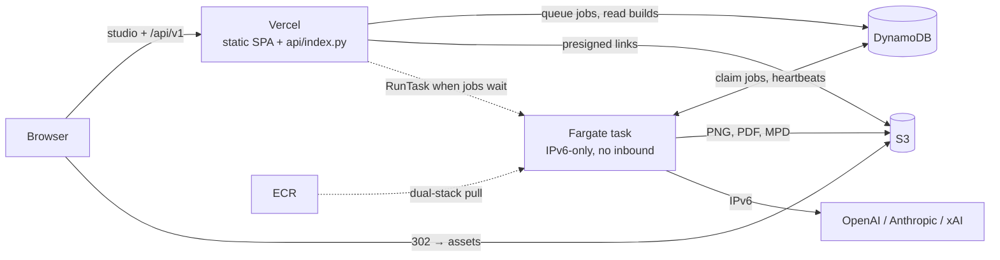

# Legolizer deployment

Low-cost demo deployment: the studio and the HTTP API run on Vercel, and one
on-demand Fargate task generates models. Setup commands are in
[instructions.md](../../instructions.md#8-run-the-generation-container-locally).

## How it works

- **API on Vercel.** `api/index.py` runs the same `legolizer.server.Handler`
  as the container, against DynamoDB and S3. It validates submissions, queues
  jobs, lists builds, and answers asset requests with a 302 redirect to a
  presigned S3 URL. Vercel caps function responses at 4.5 MB and PDFs are about
  9 MB, which is why assets are redirected rather than streamed. The studio
  calls `/api/v1` on its own origin, so there is no CORS setup.
- **Queue.** A job is a DynamoDB item with `status=queued`. The worker claims
  the oldest one with a conditional write and sends a heartbeat every 30 s.
  Jobs whose heartbeat is older than `LEGOLIZER_STALE_SECONDS` are marked
  failed; they are not replayed, to avoid repeating paid provider calls. Once
  `LEGOLIZER_MAX_PENDING` jobs are pending, new submissions get 429.
- **One worker, on demand.** A `WORKER` item in the table is the lease. When
  a job is queued and no worker has renewed the lease recently, the API
  reserves it (conditional write) and calls `ecs:RunTask`, so at most one task
  runs. The task renews the lease every 30 s. After
  `LEGOLIZER_IDLE_EXIT_SECONDS` without work, it releases the lease, checks the
  queue one last time, and exits. The API queues first and reads the lease
  second, while the worker does the reverse, so a job submitted during shutdown
  is always picked up. Listing jobs also retries the start if a task failed to
  launch.
- **No public IPv4.** The task runs in IPv6-only subnets with an egress-only
  internet gateway and a security group with no inbound rules. It pulls from
  ECR's dual-stack registry name (`<acct>.dkr-ecr.<region>.on.aws`), and
  `AWS_USE_DUALSTACK_ENDPOINT=true` sends boto3 to the IPv6 S3 and DynamoDB
  endpoints. CloudWatch Logs, Secrets Manager, OpenAI, Anthropic, and xAI are
  also reachable over IPv6. That removes the NAT gateway, VPC endpoints, load
  balancer, and IPv4 address charges.
- **Storage.** Builds go to `s3://<bucket>/builds/<id>/`. Their DynamoDB item
  (`pk=BUILD#<id>`) holds the build metadata and an `objects` map from file
  name to S3 key. Uploads go under `uploads/`, which expires after 30 days. The
  schema is `table-schema.json`, which CDK, compose, and the moto tests all
  read.

## Files

| Path | Role |
| --- | --- |
| `../../api/index.py`, `../../vercel.json` | Vercel function entry point and routing (`/api/v1/*` → function, rest → `src/frontend/dist`) |
| `docker/Dockerfile` | Generation image (Ubuntu 22.04, amd64, LPub3D under Xvfb) |
| `docker/compose.yaml` | Local stack: the container (API + worker), DynamoDB Local, S3Mock |
| `container.env` | Runtime settings shared by compose, the Fargate task, and Vercel |
| `table-schema.json` | DynamoDB key schema and indexes |
| `cdk/` | `LegolizerData` (ECR, S3, DynamoDB, secret) and `LegolizerWorker` (IPv6 VPC, cluster, task, Vercel IAM user) |
| `scripts/validate-local.sh` | Build + local smoke test; gate for deploy |
| `scripts/smoke_test.py` | Queue/output checks against local or deployed APIs |
| `scripts/deploy.sh` | Deploy data stack, store keys, push image, deploy worker stack |
| `scripts/deploy-frontend.sh` | Set Vercel env vars (rotating the AWS key) and `vercel deploy --prod` |
| `scripts/destroy.sh` | Stop tasks, delete the key, `cdk destroy --all` |

## Costs (us-east-1)

| Item | Cost |
| --- | --- |
| Fargate task, 2 vCPU / 12 GB on-demand | about $0.135 per running hour, only while started |
| Public IPv4, NAT, load balancer, VPC endpoints | none |
| Secrets Manager (1 secret) | $0.40 / month |
| ECR (last 3 images), S3, DynamoDB on-demand, CloudWatch Logs | cents / month at demo volume |
| Vercel Hobby | free |

A typical session costs 1–2 minutes of startup, the jobs themselves, and 15
idle minutes before shutdown: roughly $0.05–0.10. `LEGOLIZER_IDLE_MINUTES=5
deploy.sh` trims the idle tail at the cost of more cold starts. Provider API
usage (OpenAI/Anthropic/xAI) is billed separately by those providers.

## Operations

- **Logs:** `aws logs tail <LogGroupName> --follow` (from
  `builds/infra/Worker-outputs.json`). The Vercel function logs appear in the
  Vercel dashboard.
- **Worker never starts:** look for `Worker start failed` in the Vercel logs
  (IAM or subnet problems), then check stopped tasks with
  `aws ecs describe-tasks` (image pull or secret errors). A failed start is
  retried the next time the studio lists jobs, after
  `LEGOLIZER_WORKER_START_SECONDS` (300).
- **Rotate provider keys:** edit `.env` and rerun `deploy.sh`; the next task
  start picks them up.
- **Local vs AWS differences:** only endpoints, credentials, and the idle
  timeout. Compose sets `AWS_ENDPOINT_URL_*`, fake keys, and a public S3
  endpoint for presigned links. Fargate adds the dual-stack flag and
  `LEGOLIZER_IDLE_EXIT_SECONDS`. The image, `container.env`, and table schema
  are identical.
