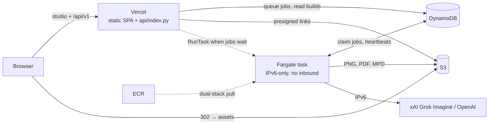

# Legolizer deployment

Low-cost demo deployment: the studio and the HTTP API run on Vercel, and one
on-demand Fargate task generates models. Setup commands are in
[instructions.md](../../instructions.md#8-run-the-generation-container-locally).

## How it works

- **API on Vercel.** `api/index.py` runs the same `legolizer.server.Handler`
  as the container, against DynamoDB and S3. It validates submissions, queues
  jobs, lists builds, and answers asset requests with a 302 redirect to a
  presigned S3 URL. Vercel caps function responses at 4.5 MB and PDFs are about
  9 MB, which is why assets are redirected rather than streamed. The studio
  calls `/api/v1` on its own origin, so there is no CORS setup.
- **Queue.** A job is a DynamoDB item with `status=queued`. The worker claims
  the oldest one with a conditional write and sends a heartbeat every 30 s.
  Jobs whose heartbeat is older than `LEGOLIZER_STALE_SECONDS` are marked
  failed; they are not replayed, to avoid repeating paid provider calls. Once
  `LEGOLIZER_MAX_PENDING` jobs are pending, new submissions get 429.
- **One worker, on demand.** A `WORKER` item in the table is the lease. When
  a job is queued and no worker has renewed the lease recently, the API
  reserves it (conditional write) and calls `ecs:RunTask`, so at most one task
  runs. The task renews the lease every 30 s. After
  `LEGOLIZER_IDLE_EXIT_SECONDS` without work, it releases the lease, checks the
  queue one last time, and exits. The API queues first and reads the lease
  second, while the worker does the reverse, so a job submitted during shutdown
  is always picked up. Listing jobs also retries the start if a task failed to
  launch.
- **No public IPv4.** The task runs in IPv6-only subnets with an egress-only
  internet gateway and a security group with no inbound rules. It pulls from
  ECR's dual-stack registry name (`<acct>.dkr-ecr.<region>.on.aws`), and
  `AWS_USE_DUALSTACK_ENDPOINT=true` sends boto3 to the IPv6 S3 and DynamoDB
  endpoints. CloudWatch Logs, Secrets Manager, OpenAI, and xAI are
  also reachable over IPv6. That removes the NAT gateway, VPC endpoints, load
  balancer, and IPv4 address charges.
- **Accounts.** With `LEGOLIZER_AUTH=google` (the default for
  `deploy-frontend.sh`), the studio loads the Google Identity Services button
  and posts its ID token to `POST /api/v1/session`. The function checks the
  token against Google's published keys, stores `USER#<id>`, and sets an
  HttpOnly cookie for a random session token. Only the token's SHA-256 hash is
  stored, as `SESSION#<hash>`. Sessions last 30 days; DynamoDB's TTL removes
  expired items, and the API also rejects them itself because TTL deletes late.
  Each signed-in request costs one extra `GetItem`. Sign-in is required to
  generate. Nothing here has a fixed cost.
- **Storage.** Builds go to `s3://<bucket>/builds/<id>/`. Their DynamoDB item
  (`pk=BUILD#<id>`) holds the build metadata and an `objects` map from file
  name to S3 key. With sign-in on, job and build items also carry the
  requester's `userId`, and the `byUser` index lists one user's jobs or builds
  (`userKind` = `<userId>#job` or `#build`) without paging the rest. Other
  users' builds and assets are refused before any link is signed. Uploads go
  under `uploads/`, which expires after 30 days. The
  schema is `table-schema.json`, which CDK, compose, and the moto tests all
  read.
- **Providers.** `container.env` sets `IMAGE_PROVIDER=grok`, so the worker draws
  concept images with Grok Imagine. The secret holds `GROK_API_KEY` and
  `OPENAI_API_KEY`. With no OpenAI key the design model is Grok too.
- **Task definition by family.** The Vercel function starts the worker by task
  definition family, which runs the latest revision. A worker-only deploy
  takes effect without touching Vercel.

## Continuous deployment

`.github/workflows/deploy.yml` runs on every push to `main` that touches the
backend (same paths as `infra.yml`) and on manual dispatch. It runs
`validate-local.sh`, assumes the `LegolizerDeploy` role through GitHub OIDC
(no stored AWS keys), and runs `deploy.sh` with `LEGOLIZER_SKIP_SECRETS=1`.
CD never writes provider keys; rerun `deploy.sh` locally to change them.
`container.env` changes do deploy, because they are part of the task definition.
CD also never changes Vercel env vars, so Google sign-in stays off (the API
defaults to `LEGOLIZER_AUTH=off`) until `deploy-frontend.sh` sets
`LEGOLIZER_AUTH` and `LEGOLIZER_GOOGLE_CLIENT_ID`. Table changes in
`table-schema.json` and `data-stack.ts` ship with CD. CloudFormation adds at most
one global secondary index per update, so merge index additions separately.

One-time setup, after a local `deploy.sh`:

1. `cd src/infra/cdk && npx cdk deploy LegolizerDeploy`. If the account already
   has a GitHub OIDC provider, add
   `-c githubOidcProviderArn=arn:aws:iam::<acct>:oidc-provider/token.actions.githubusercontent.com`.
   Override `-c githubRepo=<owner>/<repo>` for a fork. Repos on GitHub's
   immutable OIDC subject also need `-c githubImmutableSubject=<sub_claim_prefix>`
   from `gh api repos/<owner>/<repo>/actions/oidc/customization/sub`.
2. In GitHub, create the `aws-production` environment and restrict it to `main`.
   The role trusts only jobs running in that environment. It is separate from
   the `Production` environment the Vercel integration manages, and GitHub
   environment names are case-insensitive.
3. Set repository variables `AWS_DEPLOY_ROLE_ARN` (stack output
   `DeployRoleArn`) and `AWS_REGION`. The worker job is skipped until the role
   variable exists.
4. Optional: if the Vercel project is not connected to GitHub, set the
   repository variable `VERCEL_DEPLOY=true` and the secrets `VERCEL_TOKEN`,
   `VERCEL_ORG_ID`, and `VERCEL_PROJECT_ID` (from `.vercel/project.json`). Env
   changes and AWS key rotation still go through `deploy-frontend.sh`.

## Files

| Path | Role |
| --- | --- |
| `../../api/index.py`, `../../vercel.json` | Vercel function entry point and routing (`/api/v1/*` → function, rest → `src/frontend/dist`) |
| `docker/Dockerfile` | Generation image (Ubuntu 22.04, amd64, LPub3D under Xvfb) |
| `docker/compose.yaml` | Local stack: the container (API + worker), DynamoDB Local, S3Mock |
| `container.env` | Runtime settings shared by compose, the Fargate task, and Vercel |
| `table-schema.json` | DynamoDB key schema and indexes |
| `cdk/` | `LegolizerData` (ECR, S3, DynamoDB, secret), `LegolizerWorker` (IPv6 VPC, cluster, task, Vercel IAM user), `LegolizerDeploy` (GitHub OIDC deploy role) |
| `../../.github/workflows/deploy.yml` | CD: validate, then `deploy.sh` on pushes to `main` |
| `scripts/validate-local.sh` | Build + local smoke test; gate for deploy |
| `scripts/smoke_test.py` | Queue/output checks against local or deployed APIs |
| `scripts/deploy.sh` | Deploy data stack, store keys, push image, deploy worker stack |
| `scripts/deploy-frontend.sh` | Set Vercel env vars (rotating the AWS key) and `vercel deploy --prod` |
| `scripts/destroy.sh` | Stop tasks, delete the key, `cdk destroy --all` |

## Costs (us-east-1)

| Item | Cost |
| --- | --- |
| Fargate task, 4 vCPU / 12 GB on-demand | about $0.215 per running hour, only while started |
| Public IPv4, NAT, load balancer, VPC endpoints | none |
| Secrets Manager (1 secret) | $0.40 / month |
| ECR (last 3 images), S3, DynamoDB on-demand, CloudWatch Logs | cents / month at demo volume |
| Vercel Hobby | free |

A typical session costs 1–2 minutes of startup, the jobs themselves, and 15
idle minutes before shutdown: roughly $0.08–0.15. `LEGOLIZER_IDLE_MINUTES=5
deploy.sh` trims the idle tail at the cost of more cold starts. Provider API
usage (xAI/OpenAI) is billed separately by those providers.

## Operations

- **Logs:** `aws logs tail <LogGroupName> --follow` (from
  `builds/infra/Worker-outputs.json`). The Vercel function logs appear in the
  Vercel dashboard.
- **Worker never starts:** look for `Worker start failed` in the Vercel logs
  (IAM or subnet problems), then check stopped tasks with
  `aws ecs describe-tasks` (image pull or secret errors). A failed start is
  retried the next time the studio lists jobs, after
  `LEGOLIZER_WORKER_START_SECONDS` (300).
- **Rotate provider keys:** export them (or edit `.env`) and rerun `deploy.sh`;
  the next task start picks them up. The secret is replaced as a whole, so
  export every key you want kept. With no keys set, the stored ones are left alone.
- **Google sign-in:** the OAuth client lives in the Google Cloud console
  ([instructions.md](../../instructions.md#9-deploy-to-aws-and-vercel) §9). Its
  authorized JavaScript origins must list the production origin exactly. If the
  button reports an origin error, add the origin there; no redeploy is needed.
  Changing the client ID means exporting `LEGOLIZER_GOOGLE_CLIENT_ID` and rerunning
  `deploy-frontend.sh`. To sign everyone out, delete the table's `SESSION#` items.
- **Local vs AWS differences:** only endpoints, credentials, and the idle
  timeout. Compose sets `AWS_ENDPOINT_URL_*`, fake keys, and a public S3
  endpoint for presigned links. Fargate adds the dual-stack flag and
  `LEGOLIZER_IDLE_EXIT_SECONDS`. The image, `container.env`, and table schema
  are identical.
